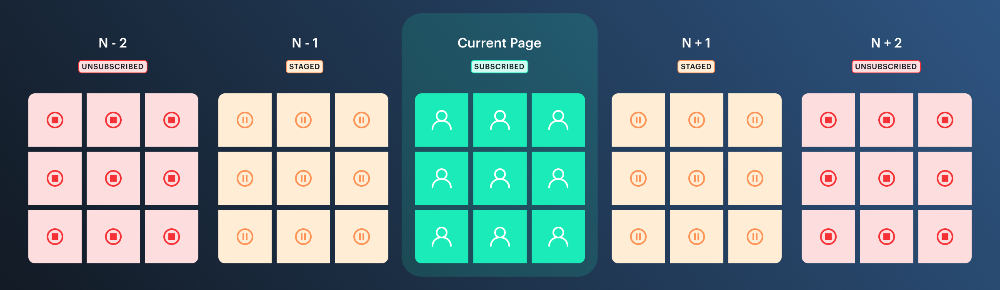
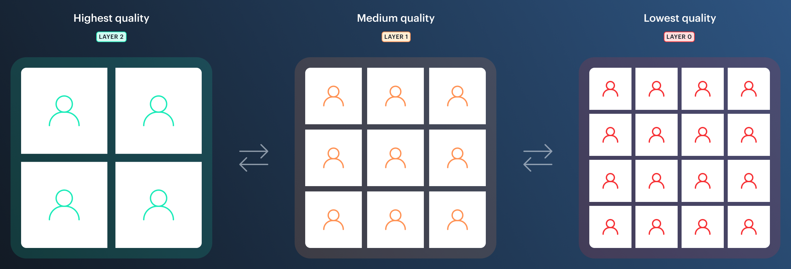

# Track subscriptions, pagination & receive settings

When call sizes exceed a certain volume (~12 or more participants) it's important to start optimising for both bandwidth and CPU. Switching from automatic to manual track subscriptions allows each client to specify which participants they want to receive video and/or audio from, reducing how much data needs to be downloaded as well as the number of connections our servers maintain.

The most common application for this in a video call application is pagination; allowing users to subscribe and stage a subset of active call participants based on their onscreen visibility and call status.

Depending on our call UI, we may also want to further optimise by selectively choosing which video layer to download from a peer dictated by our simulcast encodings settings (for example, limiting smaller tiles to lower quality video.)

This project demonstrates both of these concepts with the help of two new features introduced in `daily-js 0.17`:

- [setSubscribedTracks](https://docs.daily.co/reference#%EF%B8%8F-updateparticipant) ('staged' tracks)
- [updateReceiveSettings](https://docs.daily.co/reference#updatereceivesettings)

---

### See it in action:

➡️ [Click here](https://track-subscriptions.vercel.app/)

### Read the full guide:

➡️ [Click here](https://www.notion.so/dailyco/Manually-managing-video-tracks-and-optimising-performance-using-updateReceiveSettings-20784b30d2a344df8310ae6386d70525)

---

## Getting started

1. Create `.env.local` and set both `DAILY_DOMAIN` and `DAILY_API_KEY`. If you don't know these, you can find them on your [Daily Dashboard](https://dashboard.daily.co)
2. Install dependencies by running `yarn`
3. Start local development server with `yarn dev`
4. Follow the full walkthrough [here](https://www.notion.so/dailyco/Manually-managing-video-tracks-and-optimising-performance-using-updateReceiveSettings-20784b30d2a344df8310ae6386d70525)

## How it works

This project is a minimal viable implementation of manual track subscriptions inside of a React (Next JS) application.

We explore the following concepts:

1. Switching to manual track subscriptions when creating the Daily Call Object.

2. Subscribing, staging and unsubscribing to participants video based on their position in a grid UI.

3. Setting custom simulcast encoding settings.

4. Switching between the various simulcast layers automatically (based on the number of onscreen participants) or by manually setting a layer per participant.

We use the following dependencies in this project:

- `next` - React based web framework
- `evergreen-ui` - functional UI components and stylings
- `sillyname` - generate random silly names for call participants
- `fast-deep-equal` - deep comparator method for use in reducers and memoization
- `use-deep-compare` - useMemo, useCallback, useEffect that deeply compares dependencies

### Notes

- This project does not (yet) incorporate participant audio or screen media tracks. If you can't hear other participants, don't be alarmed!

- Staging tracks and updating receive settings will only work when the call is running in SFU mode. To illustrate this we're calling `setNetworkTopology` which is not recommended for production applications.

---

## Further optimisations

- React context are a great way to implement Redux-like states into our application although our application is render heavy without memoized selectors/reselectors.
